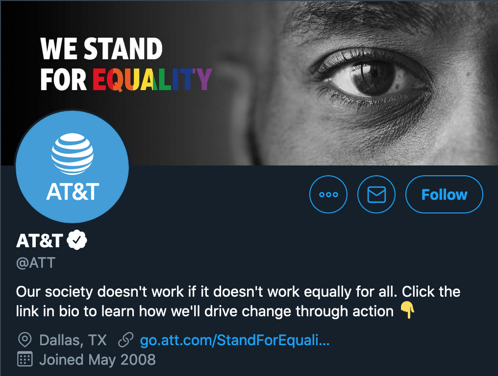
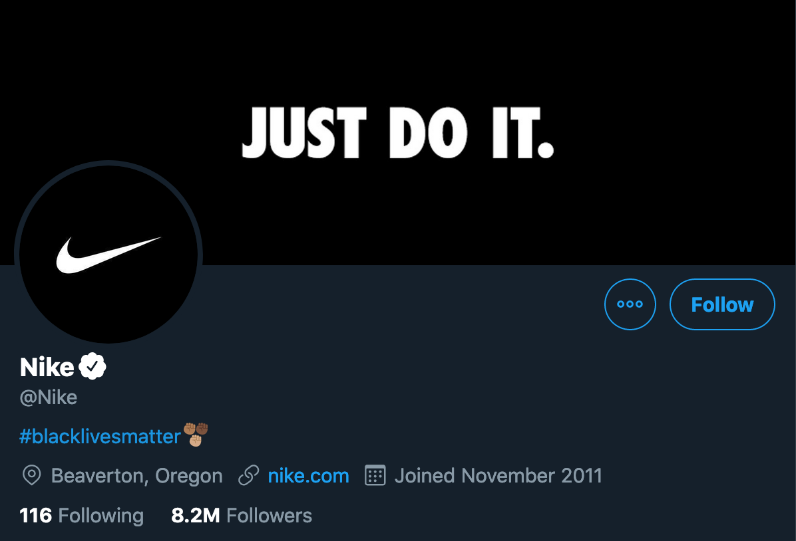

# The Corporate Response to #BlackLivesMatter on Twitter

Dataset website: https://kmcelwee.github.io/fortune-100-blm-report/site/

Twitter data from Fortune 100 companies from May 25 to July 25, 2020, the two months following the death of George Floyd. All tweets have been manually categorized to help analyze the corporate response to the #BlackLivesMatter protests.

## File Summaries

### `fortune-100.csv`

Twitter handles and sectors for the [2020 Fortune 100](https://fortune.com/fortune500/2020/search/)

Columns:

- `Corporation`: corporation name
- `URL`: url to Twitter profile
- `Rank`: Fortune 100 rank
- `Handle`: Twitter handle (a subset of URL)
- `Sector`: sector as determined by Forbes. Note: some categories have only one member (e.g. Disney is the only Forbes 100 company in the "Media" sector)

Predictably, there is not a perfect one-to-one match between every Fortune 100 company and a Twitter account. Alphabet, Google's parent company, doesn't have a Twitter account, but Google does. So each mapping, attempts to answer the question "Were this corporation to make some kind of public statement concerning racial justice, what account would they use?"

Some companies don't have a Twitter, their accounts are used strictly to recall products, or they have an account, but don't tweet. The following members of the Fortune 100 were not mapped to an account: Apple, Berkshire Hathaway, AmerisourceBergen, Costco Wholesale, JPMorgan Chase, HCA Healthcare, TJX, World Fuel Services, Plains GP Holdings. The other 91 members have been mapped to a single Twitter account.

### `fortune-100-json/`

A directory of raw JSON data pulled from each company's Twitter profile. No replies are included. Many tweets previous to May 25 were pulled to determine how behavior might have changed. Through its API, Twitter allows a user to pull the latest 3200 tweets from a user.

### `fortune-100-tweets.csv`

A CSV that attempts to summarize all data found in the `fortune-100-json/` directory by pulling out its most important features.

- `ID`: tweet ID
- `Corporation`: name of company
- `Text`: the full text of the tweet
- `Datetime`: the time the tweet was sent
- `Hashtags`: hashtags used, separated by a semicolon
- `Racial Justice`: Answers the question "Does this tweet directly address the subject of racial inequity as it relates to the death of George Floyd and subsequent protests?" More details below

For all `Racial Justice` tweets, I've applied the following sub-tags:

- `BLM`: Does this tweet or the media attached to this tweet explicitly contain the words "Black Lives Matter"?
- `Juneteenth`: Does this tweet address Juneteenth?
- `Money`: Does this tweet mention the corporation's donations to causes (internal or external) addressing racial inequity?

These values are null for any non-Racial Justice tweets.

It's difficult to be rigid with this taxonomy. For example, corporate celebrations of Juneteenth were largely a nod to recent activism, but does it necessarily mean that a corporation is expressing support for the Black Lives Matter movement? Some other gray areas are noted below. This dataset only contains tweets between May 25 and July 25, 2020; however, more data is available in the raw JSON folder. Tweets that simply say "we promote diversity!" without addressing the current moment were not categorized as `Racial Justice` tweets. Lockheed Martin, for example, [tweeted](https://twitter.com/LockheedMartin/status/1283068743569092608) [twice](https://twitter.com/LockheedMartin/status/1265643928159694849) about the importance of diversity in hiring, but never addressed that anything especially fraught was happening.

Naturally, this dataset should be approached with tremendous care, as a lot of nuance is lost when reducing each tweet to a binary.

### `rj-imgs/`

Images gathered from all Racial Justice tweets. Videos were downloaded as thumbnails.

### Other files
- The `tmp` directory is used for unimportant CSVs or data saved mid-pipeline. It's not validated, so only trust data in the `data` repository.
- `.github/` performs data validation through the [Frictionless Data](https://frictionlessdata.io/) framework and custom scripts in `test.py`. It runs `python test.py` and `goodtables datapackage.json` as well as `python pipeline.py` to make sure that both the published data meets the schema requirements and that the pipeline transforms data into a schema that meets our requirements.
- `pipeline.py` outlines how the data was processed from raw JSON data and Google Form entry.

## Other Notes

- AT&T and Nike made their Black Lives Matter campaigns central to their profile.

AT&T Twitter Profile               |  Nike Twitter Profile 
:-------------------------:|:-------------------------:
 | 

(July 2020)

- Corporations heavily relied on images with text, for example [this tweet from Amazon](https://twitter.com/amazon/status/1267140211861073927). Querying the `full_text` field will not return all "text" that a corporation tweeted.
- An ADM spokesperson recommended the handle [@ADMUpdates](https://twitter.com/ADMUpdates) instead of [@TradeADMIS](https://twitter.com/TradeADMIS). Swapping it out wasn't necessary for my purposes, but for others using `fortune-100.csv`, the distinction might be important.
- This dataset doesn't contain data from Twitter for Advertisers, a legacy Twitter advertising system. I found [one Coca Cola tweet](https://twitter.com/CocaCola/status/1268235977614655488) that was sponsored that is not included in the dataset; however, other companies may have done the same thing.
- It would be great to know reply counts to get an idea of the general response to some of these campaigns (dividing likes by replies, is a crude but helpful heuristic to measure audience support for a tweet). But for some reason it is absent from the Twitter API.
- Other useful datapoints that are hidden from API public view is whether tweets were promoted, and what companies had to hide hateful replies.
- Some tweets contained the carriage return `\r`. They were replaced with `' '` to prevent malformed CSVs.
- Lowe's retweeted their CEO, however, the window passed for the API to collect the retweet ID. The JSON data was reconstructed, with the ID and `created_at` field set equal to their CEO's ID. Otherwise, original IDs, not retweet IDs, are listed in all CSVs and JSONs. If one needs an `is_retweet` field, I recommend filtering by tweets starting with `RT @` or drawing directly from the raw JSON.
- Replies are not included in the dataset, this includes threads. Only the top-most tweet is included, but all categorizations apply to the entire thread.
- UTC is used.
- Goldman Sachs plays an odd role here, because they use their Twitter more like a news organization than a PR platform. They host talks with prominent leaders, so naturally, they hosted speakers to speak about racial inequity in the US. These videos are categorized as `Racial Justice` tweets because they addressed racial inequity, and Goldman used their platform to share these conversations.
- Lastly, a reminder that this data only helps reveal how companies chose to act *on Twitter*, and does not necessarily reflect their full efforts to address racial inequity.

## Quick setup

If for some reason you'd like to run the pipeline locally. Create a Python 3.8 environment and install the necessary libraries using `pip install -r requirements.txt`. Execute with `python pipeline.py`. If, for some reason, you'd like to re-download the media associated with the tweets, run `python pipeline --download`.

## Contact

Feel free to [reach out](mailto:kevinrmcelwee@gmail.com) with any questions!
